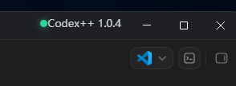

# Codex++

<p align="center">
  
</p>

<p align="center">
  <a href="README.md">中文</a> | English
</p>

<p align="center">
  
  
  
  
</p>

Codex++ is an external enhancement launcher for the Codex App. It does not modify the original Codex App installation. Instead, it launches Codex externally and injects enhancement scripts through the Chromium DevTools Protocol.

## Table of Contents

- [Community](#community)
- [Quick Start](#quick-start)
- [Highlights](#highlights)
- [Screenshots](#screenshots)
- [Provider Sync](#provider-sync)
- [Friendly Links](#friendly-links)
- [How It Works](#how-it-works)
- [Requirements](#requirements)
- [Windows Usage](#windows-usage)
- [Auto Update](#auto-update)
- [macOS Usage](#macos-usage)
- [Direct Launch](#direct-launch)
- [Data and Backups](#data-and-backups)
- [FAQ](#faq)
- [Contributors and Stars](#contributors-and-stars)
- [Development](#development)

## Community

Scan the QR code to join the Codex++ discussion group, report issues, share usage notes, or suggest features:


## Quick Start

Windows users can double-click this file in the project root:

```text
setup.bat
```

Then choose:

```text
[1] Install Codex++
```

After setup, a `Codex++.lnk` shortcut is created on the desktop. Double-click it to launch Codex with Codex++ enhancements.

You can also install and launch from the command line:

```bash
python -m pip install -e .
python -m codex_session_delete setup
python -m codex_session_delete launch
```

macOS users can run:

```bash
python -m codex_session_delete setup
```

This creates `/Applications/Codex++.app`.

## Highlights

- Adds a `Codex++` menu to the top bar for managing enhancement features.
- Plugin entry unlock: shows and enables the plugin entry in API Key mode.
- Forced plugin install: removes frontend install blocking caused by App unavailable states.
- Session delete: shows a delete button on session row hover, with confirmation and undo.
- Markdown export: exports local rollout conversations to timestamped Markdown files.
- Project move: moves sessions into normal conversations or other local projects.
- Conversation Timeline: shows user-question markers on the right side of a conversation, with hover summaries and quick jump.
- Provider Sync: switch model_provider without losing historical conversations.
- Windows shortcut setup/removal, optional watcher takeover, and GitHub Release updates.
- macOS `/Applications/Codex++.app` bundle generation.

## Screenshots

In API Key mode, the native Codex plugin entry may require ChatGPT login and remain unavailable:


The native Codex session list only has archive actions and no real delete button:


After launching through Codex++, the plugin entry is unlocked and a delete button appears when hovering a session:


The top bar shows `Codex++`, backend status, and the settings panel:




## Provider Sync

When `Provider Sync` is enabled, Codex++ synchronizes local session metadata before launching Codex. It aligns rollout files, SQLite thread records, and project path caches with the current `model_provider`, so you can switch providers without losing historical conversations.

Use it when:

- Old conversations disappear in Desktop or `/resume` after switching from OpenAI to another provider.
- You switch back to another provider and want historical conversations to stay visible under the original project.
- Windows paths with a `\\?\` prefix prevent Desktop project matching.

Provider Sync only fixes metadata related to conversation visibility. It does not rewrite message content. If Codex is holding a file lock or SQLite is busy, Codex++ skips the busy item and keeps launching Codex instead of blocking startup.

## Friendly Links

- [LINUX DO](https://linux.do)

## How It Works

Codex++ launches Codex externally:

1. Starts the Codex App with:
   - `--remote-debugging-port=9229`
   - `--remote-allow-origins=http://127.0.0.1:9229`
2. If Provider Sync is enabled, synchronizes historical session metadata before launching Codex.
3. Starts a local helper service for health checks and runtime operations.
4. Injects `renderer-inject.js` through CDP.
5. The renderer talks to local services through the CDP bridge. Delete/undo HTTP routes are not exposed by default, which prevents accidental deletion from unrelated local pages.
6. Codex inherits existing `HTTP_PROXY` / `HTTPS_PROXY` / `ALL_PROXY`; if none are set, Codex++ auto-detects common local proxy ports such as `127.0.0.1:7897` to help Codex load GitHub-hosted skill resources.

This approach does not modify Codex `app.asar` and does not write DLL files into the Codex installation directory.

## Requirements

- Python 3.11+
- Windows or macOS
- Codex App installed

Install dependencies:

```bash
python -m pip install -e .
```

Run tests:

```bash
python -m pip install -e .[test]
python -m pytest -q
```

## Windows Usage

### GUI setup/removal

Double-click this file in the project root:

```text
setup.bat
```

Then choose from the menu:

```text
[1] Install Codex++
[2] Uninstall Codex++
[3] Update Codex++
[4] Exit
```

### Command-line setup

Run in the project directory:

```bash
python -m codex_session_delete setup
```

After setup, a desktop shortcut is created:

```text
Codex++.lnk
```

Double-click it to launch Codex++.

### Command-line removal

You can remove `Codex++` from Windows Settings → Apps → Installed apps.

Or run in the project directory:

```bash
python -m codex_session_delete remove
```

To also delete Codex++ logs and backup data:

```bash
python -m codex_session_delete remove --remove-data
```

### Optional Windows watcher takeover

By default, Codex++ only takes effect when you launch Codex from the `Codex++` shortcut. If you start the original Codex entry from the Start menu or taskbar, that run will not include injection.

The optional Windows watcher solves this by checking the local CDP port every 3 seconds. If it finds the Codex Desktop App running without CDP, it waits briefly, confirms again, then relaunches the Desktop App through the Codex++ launcher.

Install:

```bash
python -m codex_session_delete watch-install
```

Remove:

```bash
python -m codex_session_delete watch-remove
```

Temporarily disable or enable takeover while keeping startup entries:

```bash
python -m codex_session_delete watch-disable
python -m codex_session_delete watch-enable
```

Logs:

```text
%USERPROFILE%\.codex-session-delete\watcher.log
```

## Auto Update

Codex++ checks GitHub Releases on startup. If a newer Release is available, it prints the version, Release URL, and update command. A failed update check does not block Codex++ startup.

Check manually:

```bash
python -m codex_session_delete check-update
```

Update from the latest GitHub Release:

```bash
python -m codex_session_delete update
```

Update flow:

1. Requests `https://api.github.com/repos/BigPizzaV3/CodexPlusPlus/releases/latest`.
2. Compares the latest Release tag with the local version.
3. Prefers a `.whl` asset from the Release.
4. Runs `python -m pip install --upgrade <wheel>`.
5. Runs `python -m codex_session_delete setup` again to refresh shortcuts, Windows uninstall entries, or the macOS app bundle.

When publishing a new version, attach a wheel to the GitHub Release:

```bash
python -m build
```

Then upload `dist/codex_session_delete-<version>-py3-none-any.whl` to the Release.

## macOS Usage

### Setup

```bash
python -m codex_session_delete setup
```

The setup command searches `/Applications/Codex.app`, `/Applications/OpenAI Codex.app`, and the user's Applications directory, then creates:

```text
/Applications/Codex++.app
```

### Removal

```bash
python -m codex_session_delete remove
```

## Direct Launch

You can launch without installing shortcuts:

```bash
python -m codex_session_delete launch
```

Common arguments:

```bash
python -m codex_session_delete launch \
  --app-dir "/Applications/OpenAI Codex.app" \
  --debug-port 9229 \
  --helper-port 57321
```

On Windows, you can also specify the Codex installation directory manually:

```bash
python -m codex_session_delete launch \
  --app-dir "C:/Program Files/WindowsApps/OpenAI.Codex_xxx/app" \
  --debug-port 9229 \
  --helper-port 57321
```

## Data and Backups

Codex++ reads the local Codex database by default:

```text
~/.codex/state_5.sqlite
```

Before deletion, related records are backed up to:

```text
~/.codex-session-delete/backups
```

Provider Sync backs up pre-sync state to:

```text
~/.codex/backups_state/provider-sync
```

Hidden launch failure logs are stored at:

```text
~/.codex-session-delete/launcher.log
```

## FAQ

### Double-clicking Codex++ does nothing

Check the log first:

```text
%USERPROFILE%\.codex-session-delete\launcher.log
```

Common causes:

- Codex App is not installed or its path changed
- Port 9229 is already in use
- Python environment is unavailable

### Skill recommendations fail to load

If the skills page reports `git fetch failed`, `unable to access 'https://github.com/openai/skills.git/'`, or cannot connect to GitHub, your machine likely cannot reach GitHub directly. Codex++ inherits existing proxy environment variables first; if none are set, it tries common local proxy ports. You can also specify one manually:

```powershell
$env:HTTP_PROXY="http://127.0.0.1:7897"
$env:HTTPS_PROXY="http://127.0.0.1:7897"
python -m codex_session_delete launch
```

### The Codex++ menu does not appear

Make sure you launched from the `Codex++` shortcut instead of the original Codex entry.

You can also check whether Codex has the CDP flag:

```text
--remote-debugging-port=9229
```

### Old conversations disappear after switching providers

Open the `Codex++` settings panel, enable `Provider Sync`, then restart Codex++. It synchronizes metadata to the current `model_provider`, making historical conversations visible under the current provider again.

### Windows uninstall fails

Update to the current version and run setup again:

```bash
python -m codex_session_delete setup
```

Newer versions write a stable uninstall entry and use an absolute Python path for removal.

## Contributors and Stars

<a href="https://github.com/BigPizzaV3/CodexPlusPlus/graphs/contributors">
  
</a>

<picture>
  <source media="(prefers-color-scheme: dark)" srcset="https://api.star-history.com/svg?repos=BigPizzaV3/CodexPlusPlus&type=Date&theme=dark">
  <source media="(prefers-color-scheme: light)" srcset="https://api.star-history.com/svg?repos=BigPizzaV3/CodexPlusPlus&type=Date">
  
</picture>

## Development

Run tests:

```bash
python -m pytest -q
```

Project structure:

```text
codex_session_delete/
  cli.py                 CLI entry point
  launcher.py            Launches Codex and injects scripts
  cdp.py                 CDP communication and bridge
  helper_server.py       Local helper service
  storage_adapter.py     Local SQLite delete/undo
  provider_sync.py       Provider Sync
  settings_store.py      Codex++ backend settings
  windows_installer.py   Windows shortcuts and uninstall entries
  macos_installer.py     macOS app bundle setup
  watcher.py             Optional Windows watcher takeover
  inject/renderer-inject.js

tests/                   Automated tests
```

## Notes

Codex++ is an external enhancement tool and does not modify original Codex App files. If a future Codex App update changes page structure, the injection script may need updates.
